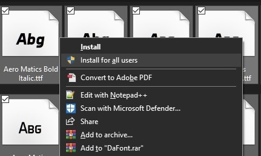

# About Font Files

When it comes to fonts, there are __[three *primary* File Formats]__:
- __[TrueType Fonts]__
	- Extension: `.ttf`
	- Designed for local installation
	- Originally designed by Apple, OS compatibility varies
		- Natively-installed MacOS fonts are only compatible with MacOS. Most other `.ttf` fonts are universally compatible with Windows and Linux.
	- __[TrueType]__ actually has __[three Sub-Types]__:
		- __[Variable TrueType]__
			- Also uses the `.ttf` extension
			- See __[Variable Fonts]__ for details
		- __[TrueType Collection]__
			- Extension: `.ttc`
			- Used to store several `.ttf` fonts in a single file (as the name implies).
- __[OpenType Fonts]__
	- Extension: `.otf`
	- Designed for local installation
	- Universally compatible for all operating systems
- __[Embedded OpenType Fonts]__
	- Extension: `.eof`
	- Designed specifically for web use
	- Universally compatible for all major browsers
	- What's the difference? See the __[System Fonts vs Web Fonts Section]__ of the __[Fonts Wiki]__ for details.

 

---

 

# Installing System Fonts

Both __[Windows]__ & __[MacOS]__ make it pretty easy to install new fonts for use throughout the __[Operating System]__. As for the other systems... well, we'll get to them later.

Just like everything in the world of technology (and life in general), there are several ways to go about installing fonts on each Operating System. This quick-guide will cover the easiest one- and *maybe* a second method, depending on the system.

## Windows Fonts

Windows, without a doubt, has the fastest and easiest method of installing dozens- or even *hundreds* of fonts all at the same time. You also have the choice to install them __[Locally]__, for just your user profile, or __[System-Wide]__ for all users.

### The Miracle-Method: 'Install All'

